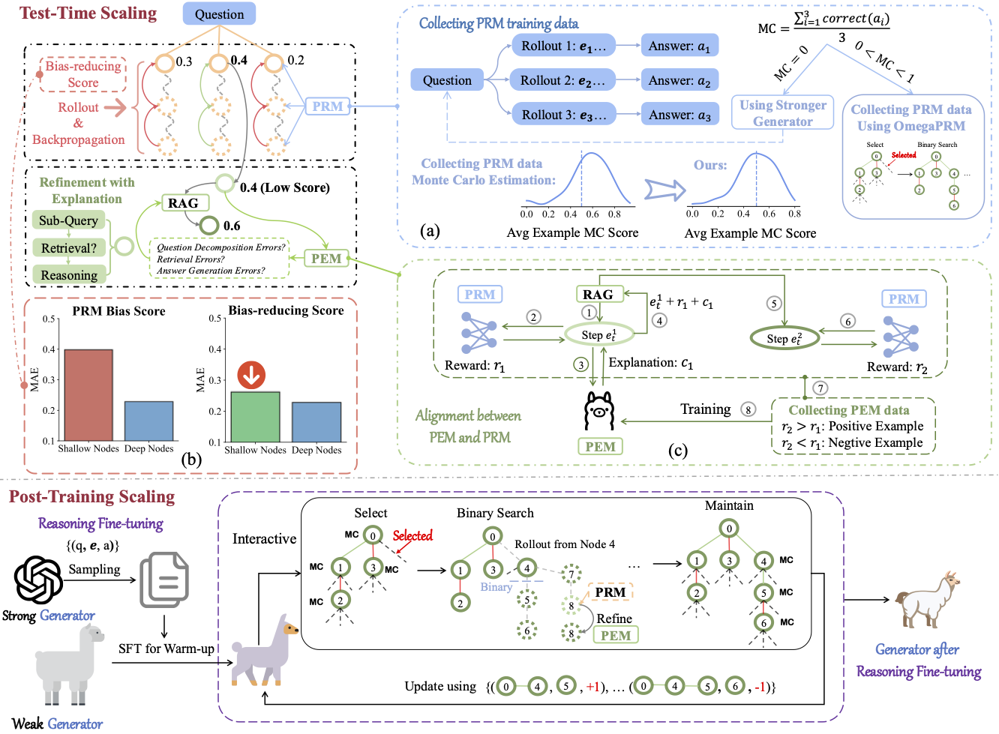

# RARTRP

The implementation of the paper: Trustworthy Process Rewarding for Retrieval-Augmented Reasoning

Retrieval-Augmented Generation (RAG) systems for Large Language Models (LLMs) have shown promise in knowledge-intensive tasks, yet their reasoning capabilities, particularly for complex multi-step reasoning, remain limited. Although recent approaches have explored integrating RAG with chain-of-thought reasoning or incorporating test-time search with process reward model (PRM), these methods face several untrustworthy challenges, including lack of explanations, bias in PRM training data, early-step bias in PRM scores, and ignoring post-training that fails to fully optimize reasoning potential. To address these issues, we propose **R**etrieval-**A**ugmented **R**easoning through **T**rustworthy **P**rocess **R**ewarding (**RARTRP**), a framework that enhances RAG systems' reasoning capabilities through both post-training and test-time scaling. At test time, RARTRP introduces Trustworthy Process Rewarding via a Process Reward Model for accurate scalar scoring and a Process Explanation Model (PEM) for generating natural language explanations, enabling step refinement. During post-training, we leverage Monte Carlo Tree Search guided by Trustworthy Process Rewarding to collect high-quality step-level preference data, which is used to optimize the model through Iterative Preference Optimization. RARTRP tackles three key challenges: (1) misalignment between PRM and PEM, addressed through off-policy preference learning; (2) bias in PRM training data, mitigated by a balanced annotation method and incorporating stronger annotations for difficult examples; and (3) early-step bias in PRM, resolved via a temporal-difference-based look-ahead search strategy. Experimental results on multi-step reasoning benchmarks demonstrate that RARTRP significantly improves reasoning performance, highlighting its potential to advance the reasoning capability of RAG systems.




# Run Experiments

## Preparation for RARTRP
1. Follow the steps in the [FlashRAG](FlashRAG/README.md) guide to set up the RAG system.
2. Follow the steps in the [LLaMA-Factory](LLaMA-Factory/README.md) guide to set up the PRM training system.
3. Follow the steps in the [trl](trl/README.md) guide to set up the PEM training and post-training system.

## Test-Time Scaling of RARTRP

### PRM Data Construction
1. Navigate to the `PRM_Data/` directory:
    - Sample 200 examples from the training sets of each dataset.
2. Start the data construction process:
    ```bash
    python run_exp_prm_data.sh
    ```
3. Extract hard data:
    ```bash
    python extract_error_questions.py
    ```
4. Re-annotate the hard data:
    - Update `my_config.yaml` and set `generator_model` to `gpt-4o`.
5. Build the dataset:
    ```bash
    python process_to_prm_data.py
    ```

#### Model Training
1. Move the PRM data to the `LLama-factory` directory.
2. Navigate to the `LLama-factory/` directory.
3. Start the training process:
    ```bash
    python run_exp_prm.sh
    ```

### PEM Data Construction
1. Move the PRM data to the appropriate folder under `FlashRAG` as training data.
2. Navigate to the `FlashRAG/run_exps` directory:
    - Run the following command:
        ```bash
        bash run_exp.sh set --split train
        ```
3. Navigate to the `../utils` directory:
    - Extract explanation alignment data from `item_immediate.jsonl`:
        ```bash
        python make_exp_data.py
        ```

#### Model Training
1. Navigate to the `../trl` directory.
2. Start the training process:
    ```bash
    bash run_kto.sh
    ```

## Post-Training of RARTRP (Iterative Process)

### Dataset Construction
1. Navigate to the `FlashRAG/utils` directory:
    - Create the warm-up dataset:
        ```bash
        python make_warm_data.py
        python make_summary_data.py
        ```
2. Navigate to the `PRM_Data/` directory:
    - Start the dataset construction process:
        ```bash
        bash run_exp_step_rft_data.sh
        ```
3. Train using either `trl` or `LLama-factory`.

### Running Inference for RARTRP
1. Navigate to the `FlashRAG/run_exps` directory:
    - Run the following command:
        ```bash
        bash run_exp.sh set --split test/dev
        ```


## Prompts
### Reasoning Prompt
```plain
REASON_PROMPT = """
Given the following question, answer it by providing up to 5 follow up questions and intermediate answers. If intermediate questions are not necessarry, answer the question directly. 

Strictly following the FORMAT defined below and Do not add any extra information or deviate from this structure.
### FORMAT:
Question: The original question provided.
Follow up: Follow up questions derived from the original question.
Search: State "Yes" if a Follow up question requires external information, or "No" if it does not. 
Retrieved documents: Include the content retrieved for each "Yes" Follow up, formatted as "\nDoc1: [Document details]".
Intermediate answer: Provide the answer to the Follow up question if Retrieved documents are available or if no Retrieved documents are needed.
...
So the final answer is: The final answer to the original question.

IMPORTANT: 
- If a Follow up question requires external information, output "Search: Yes." and pause generation, awaiting retrieved documents.
- If the retrieved documents do not contain information relevant to the Follow up question, do not rely on them for your response; instead, answer based on your existing knowledge.
- If "So the final answer is:" or "Intermediate answer:" appears, an answer must be generated.


#### Examples (Strictly Follow the Examples Below):

# This example demonstrates how to decompose the question and, when the answer to the follow-up question is unknown, output 'Search: Yes' to retrieve external knowledge.
Question: Who is the mother of the director of film Polish-Russian War (Film)?
Follow up: Who is the director of the film Polish-Russian War (Film)?
Search: Yes.
Retrieved documents: \nDoc1: Xawery Żuławski: Polish-Russian War (Wojna polsko-ruska) is a 2009 Polish film directed by Xawery Żuławski based on the novel Polish-Russian War under the white-red flag by Dorota Masłowska.
Intermediate answer: The director of the film Polish-Russian War is Xawery Żuławski.
Follow up: Who is the mother of Xawery Żuławski?
Search: Yes.
Retrieved documents: \nDoc1: Xawery Żuławski: Xawery Żuławski ; National Film School in Łódź · 1995–present · Maria Strzelecka · Małgorzata Braunek gave birth to Xawery Żuławski in ...
Intermediate answer: The mother of Xawery Żuławski is Małgorzata Braunek.
So the final answer is: Rick Scott Małgorzata Braunek.

# This example demonstrates a question that can be answered directly without decomposition and without requiring external knowledge.
Question: What is the capital of the United States?
So the final answer is: Washington D.C.

# This example demonstrates a case where the question can be answered directly without decomposition but requires external knowledge.
Question: What's the day of the week today in Washington, D.C.?
Follow up: What's the day of the week today in Washington, D.C.?
Search: Yes.
Retrieved documents:\nDoc1: Current time and date: 06:53:52 EST, Sunday, 3 November 2024 Location Details: - Country: United States - Federal District: District of Columbia (DC) ... \nDoc2: As of 06:53:52 EST on Sunday, November 3, 2024, in Washington, D.C.: Country...
Intermediate answer: The current day of the week in Washington, D.C. is Sunday.
So the final answer is: Sunday.

# This example demonstrates that for some decomposed follow-up questions where no external knowledge retrieval is required, the output should be 'Search: No' and directly answer the follow-up question. 
Question: What is the current weather in the U.S. capital?
Follow up: What is the U.S. capital?
Search: No.
Intermediate answer: The U.S. capital is Washington, D.C.
Follow up: What is the current weather in Washington, D.C.?
Search: Yes.
Retrieved documents:\nDoc1: As of 9:33 PM Eastern Standard Time on Sunday, November 3, 2024, in Washington, D.C., the weather is clear with a temperature of 50°F (10°C). The humidity is at 64%, and there's a northeast wind blowing at 6 mph. 
Intermediate answer: Currently, the weather in Washington, D.C., is clear and 50°F (10°C) with 64% humidity. 
So the final answer is: The weather in Washington, D.C., is clear and 50°F (10°C) with 64% humidity. """
```
```paine
SUMMATY_PROMPT = """
Please answer the question based on the reasoning path. Ensure the answer is accurate and concise! If the reasoning path does not contain the answer to the question, please answer directly based on your knowledge.
Question: {}
Reasoning Path: {}
Answer:"""
```
### PEM prompt
```plain
EXP_SYS_PROMPT = """You are a Critic model tasked with evaluating the reasoning process of an Actor model as it tackles complex questions. The Actor model generates a series of reasoning steps, and the Reward Model provides scores for these steps. Your job is to assess the Actor model's current reasoning steps, taking into account the Reward Model's scores, and provide specific suggestions for improvement. """

EXP_PROMPT = """
Here is the relevant information:
- Question: {}
- Previously generated reasoning steps: {}
- Current reasoning step: {}
- Reward Model score: {}
- Future reasoning steps: {}

Please evaluate the Actor model's current reasoning step based on the following potential error categories and provide specific suggestions for improvement:

1. Are there Question Decomposition Errors?
    1.1. Are the sub-questions irrelevant to the main question?
    1.2. Is there inadequate or inaccurate decomposition of sub-questions?
    1.3. Are there any other relevant issues?

2. Are there Retrieval Errors?
    2.1. Do the retrieved documents contain noise or erroneous information?
    2.2. Are the retrieved documents inadequate or irrelevant?
    2.3. Are there any other relevant issues?

3. Are there Answer Generation Errors?
    3.1. Is the answer irrelevant to the query?
    3.2. Is the answer inaccurate or incorrect?
    3.3. Is the answer incomplete?
    3.4. Are there any other relevant issues?

Please analyze the current reasoning step based on the above error categories and provide specific suggestions for improvement. Please keep your response concise and accurate.
```

### Refinement prompt
```plain
CORRECT_PROMPT =  """
You are an Actor model tasked with refining the current reasoning step based on feedback from the Critic model and Reward model:

Here is the relevant information:

Question: {}
Previously Generated Reasoning Steps: {}
Current Reasoning Step: {}
Reward Model Score: {}
Critic Model's Suggested Fixes: {}
You can take one of the following actions:

Action 1: Provide a new query and decide whether to search.
Action 2: Keep the old query but modify whether to search.
Action 3: Directly output the final answer.
Please format your output as follows:

Please respond in the following JSON format:

For Action 1:
{{"Action": "Action1", "Query": "new query", "Search": "Yes or No"}}

For Action 2:
{{"Action": "Action2", "Query": "old query", "Search": "Yes or No"}}

For Action 3:
{{Action: "Action3"}}
"""
```


# Reference Repositories
We would like to extend our heartfelt thanks to the developers of the following projects for their valuable code references:

- [LLaMA-Factory](https://github.com/hiyouga/LLaMA-Factory)
- [FlashRAG](https://github.com/RUC-NLPIR/FlashRAG?tab=readme-ov-file)
- [openr](https://github.com/openreasoner/openr)
- [trl](https://github.com/huggingface/trl)


    


